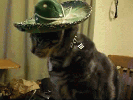
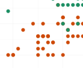
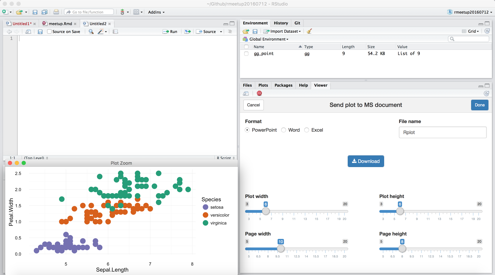
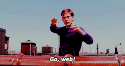

```{r setup, include=FALSE, echo=FALSE}
knitr::opts_chunk$set(echo = FALSE)
library(ggiraph)
library(magrittr)
```

## { .fullpage .white }

<div class="fullpage height">

</div>

<div class="double">

<p class="double-flow" style="font-size:1.5em;color:#006699;font-weight:bold;">Les graphiques vectoriels avec `RVG` et `ggiraph`</p>

<p class="double-flow" style="color:#006699;"><br/><br/><br/>
<span style="font-family: 'slashfoldregular';font-size:2em;">ArData</span><br/>
<span style="font-style:italic;font-size:.7em;">data science, statistique, formations R, open source</span><br/>
david.gohel@ardata.fr<br/>R addicts Paris - 12 Juillet 2016</p>

</div>

##  { .fullpage }

> Communiquer **rapidement et facilement** les graphiques produits **avec R** sans perte de **qualité** et dans les **formats usuels des entreprises**.

* des *devices graphiques* R
* produisent des graphiques vectoriels Microsoft et HTML.
* Les formats Microsoft sont éditables.
* Les formats HTML sont dynamiques.


##  Galaxie - contexte d'utilisation

<div style="text-align:right;">
<span style="background-color:rgb(0, 102, 153);font-size:.5em;border-radius:10px;">&nbsp;&nbsp;&nbsp;&nbsp;outil&nbsp;&nbsp;&nbsp;&nbsp;</span>&nbsp;
<span style="background-color:rgb(199, 181, 112);font-size:.5em;border-radius:10px;">&nbsp;&nbsp;ggplot dynamiques&nbsp;&nbsp;</span>&nbsp;
<span style="background-color:rgb(255, 153, 0);font-size:.5em;border-radius:10px;">&nbsp;&nbsp;graphiques R éditables&nbsp;&nbsp;</span></div>

```{r}
library(networkD3)# Load data

mynodes <- data.frame(
  name = c("RVG", "ggiraph & ggplot2", "ReporteRs", "knitr ou rmarkdown", "shiny", "rstudio"),
  group = c("outil", "outil", "Word/PowerPoint", "htmlwidget", "htmlwidget", "htmlwidget"),
  size = c(50, 50, 25, 25, 25, 25),
  stringsAsFactors = FALSE
)

mylinks <- data.frame(
  source = c(0, 0, 1, 1, 1),
  target = c(1, 2, 3, 4, 5),
  lcol = c("#999999", "#CA6259", "#CA6259", "#CA6259", "#CA6259"),
  stringsAsFactors = FALSE
)
mylinks$value <- 3

ColourScale <- 'd3.scale.ordinal()
.domain(["outil", "htmlwidget", "Word/PowerPoint"])
.range(["#006699", "#C7B570", "#FF9900"]);'

forceNetwork(Links = mylinks, Nodes = mynodes, Nodesize = "size", zoom = TRUE, 
                   fontSize = 20, fontFamily = "Arial",linkColour = mylinks$lcol,
             Source = "source", Target = "target",
             Value = "value", NodeID = "name",legend= FALSE,
             Group = "group", opacity = 1, colourScale = JS(ColourScale))

```


## Devices graphiques?{ .fullpage .white }




## Code ggplot d'exemple { .red }

```{r echo=TRUE}
gg_point <- ggplot(iris, aes(x = Sepal.Length, y = Petal.Width,
		color = Species) ) + theme_minimal() + 
	geom_point(size = 5) + 
  scale_colour_manual(values = c("#7570b3","#d95f02", "#1b9e77"))
gg_point
```

## Rendu raster




## Rendu vectoriel (sortie ggiraph)


```{r}
ggiraph(code = {print(gg_point + theme(plot.background=element_rect(fill="white", color="transparent")))}, width = 1, width_svg = 8, height_svg = 6, zoom_max = 10 )
```


## { .fullpage }

<h2 class="shout">Graphiques éditables dans Microsoft Office</h2>

## Avec ReporteRs

```{r echo=TRUE, results='hide', message=FALSE}
library(ReporteRs)
pptx() %>% 
  addSlide("Title and Content") %>% 
  addTitle("Mon graphique") %>% 
  addPlot(fun = print, x = gg_point) %>% # le boulot de RVG
  writeDoc("assets/my_file.pptx")
```

<div class="icons">

<a href="assets/my_file.pptx"></a>

</div>


## Avec rvgaddin (Add-in RStudio)


Permet l'exportation des graphiques actifs en Word/PowerPoint/Excel




**le boulot de RVG**


## { .fullpage }

<h2 class="shout" style="color:#006699;">Graphiques dynamiques avec ggiraph</h2>



## Package `ggiraph`

> des fonctions `geom_*_interactive` et la fonction `ggiraph`

* mi htmlwidget mi extension de ggplot2
* rvg pour le svg depuis R et d3.js pour l'animation


```{r echo=TRUE}
library(tibble)
mtcars <- rownames_to_column(mtcars, var = "car")
gg_point <- ggplot(mtcars ) + theme_minimal() + 
  geom_point_interactive(aes(x = drat, y = qsec, color = disp, 
  tooltip = car, data_id = car), size = 5)
```


## { .fullpage }

```{r echo=TRUE}
ggiraph(print(gg_point), width = .7, width_svg = 6, height_svg = 4.5)
```

## { .fullpage }

<h2 class="shout">Avec shiny</h2>

https://davidgohel.shinyapps.io/demoggiraph/


## Merci!

les packages de la présentation :

* https://cran.r-project.org/package=ggplot2
* https://cran.r-project.org/package=ggiraph
* https://cran.r-project.org/package=rvg
* https://cran.r-project.org/package=ReporteRs
* https://github.com/davidgohel/rvgaddin `devtools::install_github("davidgohel/rvgaddin")`

## Les sources

https://github.com/davidgohel/demoggiraph

