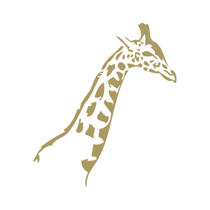

```{r setup, include=FALSE, echo=FALSE}
knitr::opts_chunk$set(echo = FALSE)
library(ggiraph)
library(magrittr)
```

## { .fullpage .white}

<div class="fullpage height">

</div>

<div class="double">

<p class="double-flow" style="font-size:1.5em;color:#006699;font-weight:bold;">Présentation des packages `RVG` et `ggiraph`</p>

<p class="double-flow" style="color:#006699;"><br/><br/><br/>
<span style="font-family: 'slashfoldregular';font-size:2em;">ArData</span><br/>
<span style="font-style:italic;font-size:.7em;">data science, consulting, formations R</span><br/>
david.gohel@ardata.fr<br/>R addicts Paris - 12 Juillet 2016</p>

</div>

##  { .fullpage }

> <span style="color:#AA9961;font-weight:bold;">Objectifs :</span><br/>Communiquer **rapidement et facilement** les graphiques produits **avec R** sans perte de **qualité** et dans les **formats usuels des entreprises**.

##  Overview

<div style="text-align:right;">
<span style="background-color:rgb(0, 102, 153);font-size:.5em;border-radius:10px;">&nbsp;&nbsp;&nbsp;&nbsp;outil&nbsp;&nbsp;&nbsp;&nbsp;</span>&nbsp;
<span style="background-color:rgb(199, 181, 112);font-size:.5em;border-radius:10px;">&nbsp;&nbsp;ggplot dynamiques&nbsp;&nbsp;</span>&nbsp;
<span style="background-color:rgb(255, 153, 0);font-size:.5em;border-radius:10px;">&nbsp;&nbsp;graphiques R éditables&nbsp;&nbsp;</span></div>


```{r}
library(networkD3)# Load data

mynodes <- data.frame(
  name = c("RVG", "ggiraph & ggplot2", "ReporteRs", "knitr ou rmarkdown", "shiny", "rstudio", "openxml"),
  group = c("outil", "outil", "Word/PowerPoint", "htmlwidget", "htmlwidget", "htmlwidget", "Word/PowerPoint"),
  size = c(50, 50, 25, 25, 25, 25, 25),
  stringsAsFactors = FALSE
)

mylinks <- data.frame(
  source = c(0, 0, 1, 1, 1, 0),
  target = c(1, 2, 3, 4, 5, 6),
  lcol = c("#999999", "#CA6259", "#CA6259", "#CA6259", "#CA6259", "#CA6259"),
  stringsAsFactors = FALSE
)
mylinks$value <- 3

ColourScale <- 'd3.scale.ordinal()
.domain(["outil", "htmlwidget", "Word/PowerPoint"])
.range(["#006699", "#C7B570", "#FF9900"]);'

forceNetwork(Links = mylinks, Nodes = mynodes, Nodesize = "size", zoom = TRUE, 
                   fontSize = 20, fontFamily = "Arial",linkColour = mylinks$lcol,
             Source = "source", Target = "target",
             Value = "value", NodeID = "name",legend= FALSE,
             Group = "group", opacity = 1, colourScale = JS(ColourScale))

```


## Code ggplot d'exemple { .red }


```{r echo=TRUE}
gg_point <- ggplot(iris, aes(x = Sepal.Length, y = Petal.Width,
		color = Species) ) + theme_minimal() + 
	geom_point(size = 5) + 
  scale_colour_manual(values = c("#7570b3","#d95f02", "#1b9e77"))
gg_point
```

## Rendu vectoriel

```{r}
ggiraph(code = {print(gg_point + theme(plot.background=element_rect(fill="white", color="transparent")))}, width = 1, width_svg = 8, height_svg = 6, zoom_max = 10 )
```

## Rendu raster


## Graphiques éditables avec ReporteRs

```{r echo=TRUE, results='hide', message=FALSE}
library(ReporteRs)
pptx() %>% 
  addSlide("Title and Content") %>% 
  addTitle("Mon graphique") %>% 
  addPlot(fun = print, x = gg_point) %>% 
  writeDoc("assets/my_file.pptx")
```

<div class="icons">

<a href="assets/my_file.pptx"></a>

</div>

## rvgaddin (Add-in RStudio)

<div class="double">

<ul><li>Permet l'exportation des graphiques actifs en Word/PowerPoint/Excel</li>
<li>Pour les feignants et les *non reproductibitistes*</li>
</ul>


```{r eval=FALSE, echo=TRUE}
if( !require("rvg") ) 
  install.packages("rvg")
devtools::install_github(
  "davidgohel/rvgaddin")
```


</div>


## Graphiques dynamiques avec ggiraph


## Présentation de `ggiraph`


* extension de ggplot2
* de nouvelles fonctions `geom_`
* un htmlwidget
* basé sur rvg et d3.js


```{r echo=TRUE}
library(tibble)
mtcars <- rownames_to_column(mtcars, var = "car")
gg_point <- ggplot(mtcars ) + theme_minimal() + 
  geom_point_interactive(aes(x = drat, y = qsec, color = disp, 
  tooltip = car, data_id = car), size = 5)
```


## { .fullpage }

```{r echo=TRUE}
ggiraph(print(gg_point), width = .7, width_svg = 6, height_svg = 4.5)
```

## { .fullpage }

<h2 class="shout">Avec shiny</h2>

https://davidgohel.shinyapps.io/demoggiraph/

